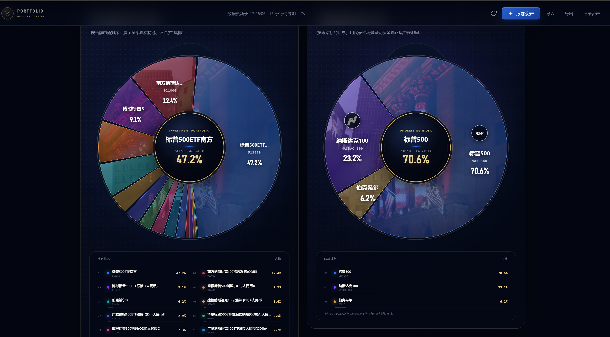

# Portfolio

一个本地运行的个人投资组合看板：用 Go + SQLite 保存持仓，用原生 HTML/CSS/JavaScript 展示资产、指数分布、收益和行情。

## 效果预览



## 功能

- 股票、基金、ETF、现金等资产录入与编辑
- 基金按投入金额自动换算成本价
- 相同市场和代码的基金新增时自动合并并计算加权成本
- 持仓市值、收益、指数暴露和总资产走势
- 支持 JSON 导入/导出
- 支持底层指数饼图导出 PNG
- 通过腾讯、天天基金及东方财富接口获取行情数据

## 快速开始（Windows）

需要 Go 1.25+。在 PowerShell 中执行：

```powershell
cd D:\learn\portfolio
.\run.ps1 -OpenBrowser
```

然后打开 <http://127.0.0.1:8889/assets/index.html>。

跳过测试并直接启动：

```powershell
.\run.ps1 -OpenBrowser -SkipTests
```

也可以手动运行：

```powershell
go test ./...
go run .
```

端口可通过参数或环境变量修改：

```powershell
.\run.ps1 -Port 8890
$env:PORTFOLIO_PORT = '8890'; go run .
```

## 数据与接口

- SQLite 数据库：`assets/portfolio.db`
- `GET/POST /api/data`：持仓数据
- `GET/POST /api/nav`：资产净值历史
- `GET /api/snapshot`：组合快照与实时行情
- `GET /api/quote/detail`：行情详情数据

服务默认只监听 `127.0.0.1`，不会直接暴露到公网。

## 开发检查

```powershell
go test ./...
node --check assets/js/main.js
node --check assets/js/donut-chart.js
git diff --check
```
